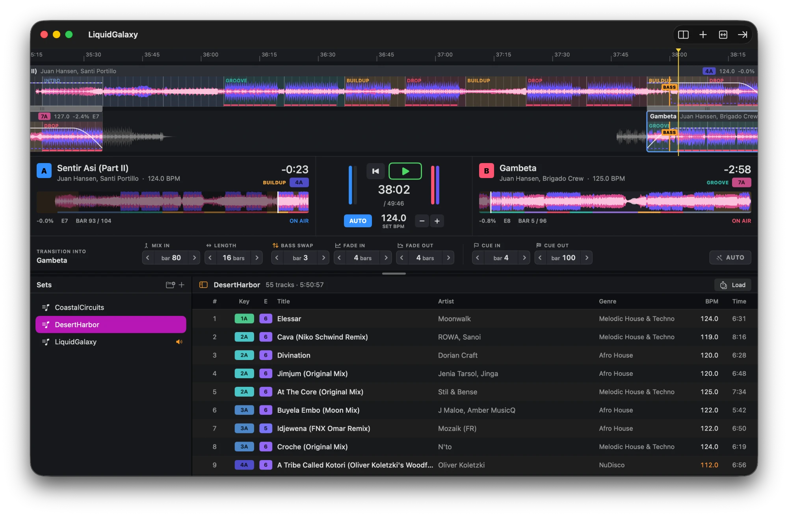

# MADSET

A native macOS app for building long DJ sets. Drag in a pile of tracks, and it works out the tempo, the beatgrid, where the drops are, and how to get from one track to the next. Then it plays the whole thing at one tempo, transitions included.



The idea is simple: light and powerful. No library to import, no subscription, no Electron. Swift, Accelerate and AVFoundation doing their job. The first time I tried it for real I dragged in about 1000 tracks and it handed me a 100-hour set almost instantly. I didn't need a 100-hour set. Nobody does. But it's good to know it's there.

It's alpha. It works, I use it, and it will still surprise you now and then.

## Install

**macOS 26+, Apple Silicon**

```bash
curl -fsSL https://raw.githubusercontent.com/clasen/MADSET/main/install.sh | bash
```

That's it. The script downloads the source, builds it with the Swift on your Mac, and installs `~/Applications/MADSET.app`, then offers to open it. To update, close MADSET and run the same command again.

**It needs Swift 6.2 or newer.** Xcode has it, and so do the much lighter Command Line Tools. No Swift on your Mac? The script runs `xcode-select --install` for you, waits while you click **Install** in the dialog, and carries on when it's done.

The build takes well under a minute on an M-series Mac. The app is signed ad hoc on your own machine, so macOS doesn't complain.

Piping a script into your shell is a matter of trust. If you'd rather read it first, [it's right here](install.sh).

## Tag your tracks with Mixed In Key first

MADSET does its own tempo, beatgrid and structure analysis. Key and energy it borrows from [Mixed In Key](https://mixedinkey.com), which does them better than anything I'd write in a weekend.

If your files carry MIK's tags (key in Camelot, energy 1 to 10), MADSET reads them and everything clicks: harmonic ordering, the energy column, and the **set curve** that warms up, peaks and lands. Untagged tracks still work. MADSET detects the key itself, a bit less reliably, but there's no energy to go on, so those tracks end up at the end when you order by curve or energy.

So: run your folder through Mixed In Key once, then drag it in here. Worth it.

## Or make it yours

MADSET is a plain Swift package. No Xcode project, nothing to configure:

```bash
git clone https://github.com/clasen/MADSET.git
cd MADSET
./scripts/bundle.sh
open build/MADSET.app
```

`swift build` and `swift test` work as you'd expect. [AGENTS.md](AGENTS.md) explains how the code is laid out, which is handy if you'd rather point a coding agent at it and ask for the thing you're missing.

Touching the analysis? There's a benchmark that analyzes a folder like the app does and compares BPM and key against the Mixed In Key tags:

```bash
swift run -c release madset-bench ~/Music/SomeFolder --limit 200
```

## Why bother

**Drag a thousand tracks, get a set.** Drop files or whole folders (MP3, AIFF, WAV, FLAC, M4A). Every track is analyzed in parallel: tempo, beatgrid, kick, and phases (intro, groove, buildup, drop, breakdown, outro) aligned to 8-bar phrases. Results are cached, so the second time is instant for real.

**Transitions that land on the phrase.** Each track mixes into the previous one in phase, with the bass swap where it belongs. If you don't like it, change the mix-in bar, length, bass swap, fades, cue in and cue out, bar by bar. **Auto** puts it back.

**One tempo for the whole set.** Leave it on the median of your tracks or pick a set BPM, and every track is stretched to it in real time with [Rubber Band](https://breakfastquay.com/rubberband/).

**Order by what matters.** Sort the set, or just the selected tracks, by set curve, energy, key (a walk around the Camelot wheel) or BPM. Undo if it's worse.

## Everything else

- Timeline with three-band waveforms, phases on top, and two decks showing what's on air and what's next
- DJ-style EQ and transition curves, so the mix sounds like a mix and not a crossfade
- Split a track at any bar and arrange the two halves like separate tracks
- Duplicate check on import, because that one track always shows up twice
- Sets live in `~/Music/MADSET`, folders are groups, and everything saves itself. Browse other sets without stopping playback
- Export the whole mix as WAV or AAC
- English and Spanish

## Standing on good shoulders

Real-time time-stretching is [Rubber Band Library](https://breakfastquay.com/rubberband/) v4.0.0 by Breakfast Quay, vendored unmodified in `Vendor/RubberBand`. It's GPL-2.0-or-later and it's the reason the set sounds like music at any tempo. Key and energy come from [Mixed In Key](https://mixedinkey.com) tags, when you have them.

## Links

[Issues](https://github.com/clasen/MADSET/issues) · [Rubber Band](https://breakfastquay.com/rubberband/) · [Mixed In Key](https://mixedinkey.com)
